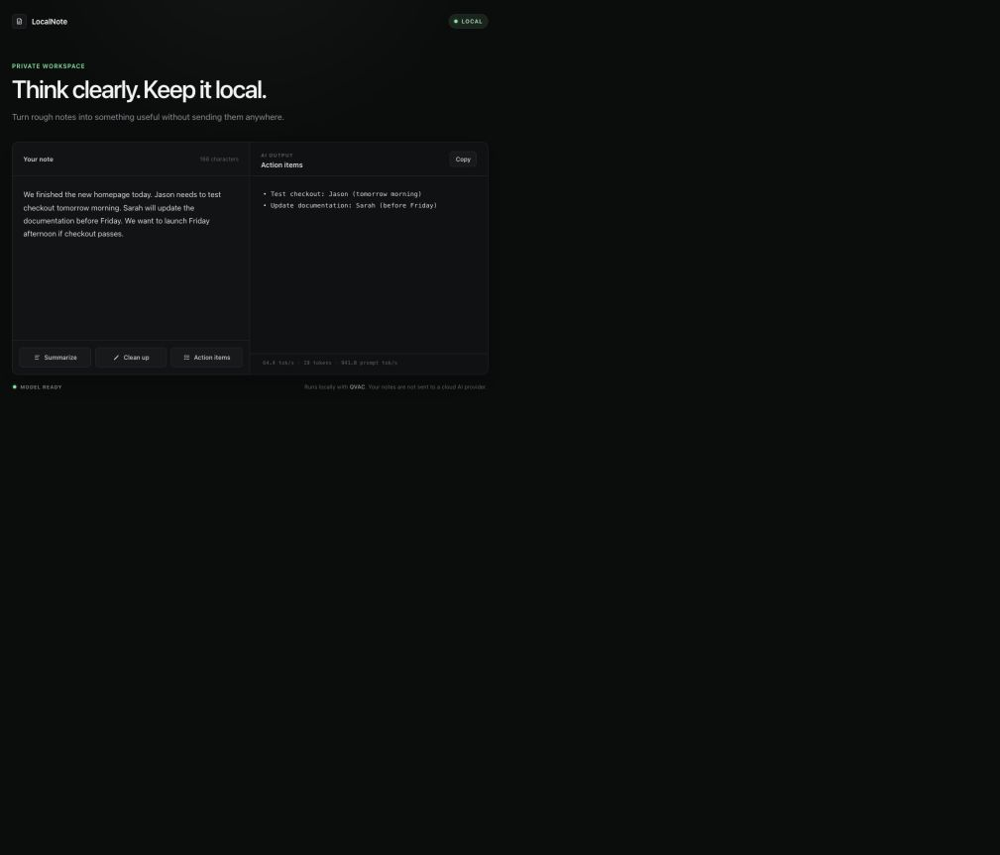

# LocalNote

LocalNote is a small, private AI scratchpad that summarizes, cleans up, and extracts action items from messy notes using local QVAC inference.

## Demo



The repository is prepared for a final screenshot at `docs/demo.png`. To capture it, start the app, wait for **Model ready**, use the sample note already in the editor, click **Action items**, and save a screenshot showing the complete workspace to that path. The generated response must be real QVAC output; no output is hard-coded.

## What it does

- **Summarize** produces a concise summary without adding unsupported facts.
- **Clean up** rewrites a note clearly while preserving its meaning and details.
- **Action items** extracts only concrete tasks supported by the note, including stated owners and timing.

Output streams into the interface as QVAC generates it. When QVAC returns generation statistics, LocalNote displays the real decode speed, token count, and prompt-processing speed.

## Why local AI

Notes can contain sensitive drafts, plans, and meeting details. LocalNote performs inference through a model running on the same machine, so note content is not sent to OpenAI, Anthropic, Gemini, or another cloud AI provider. No API key is required.

## QVAC

**QVAC SDK version: 0.19.1**

LocalNote declares both `@qvac/sdk@0.19.1` and `@qvac/inference@0.19.1`, as recommended for this QVAC release. The server calls:

- `loadModel()` to download (when needed), verify, and load the local model.
- `completion()` with streaming enabled to generate each result locally.
- `unloadModel()` during graceful shutdown.

Model: `LLAMA_3_2_1B_INST_Q4_0` — Llama 3.2 1B Instruct, Q4_0 quantization, from the QVAC model registry.

## Requirements

- Node.js 22.17 or newer
- npm 10.9 or newer
- A supported QVAC desktop host
- Approximately 1 GB of free disk space for dependencies and the 773 MB model asset
- Enough memory to load the model

See the [official QVAC system requirements](https://docs.qvac.tether.io/system-requirements/) for current operating-system, GPU-driver, and runtime details.

## Installation

```bash
git clone https://github.com/YOUR_USERNAME/localnote-qvac.git
cd localnote-qvac
npm install
```

No `.env` file, account, or API key is needed.

## Running

```bash
npm start
```

Open [http://127.0.0.1:4173](http://127.0.0.1:4173). On the first run, QVAC downloads and verifies the model before loading it. The UI shows real download progress and changes to **Model ready** when inference is available. Later runs reuse the local model asset.

To run the small prompt-construction test suite:

```bash
npm run verify
```

## Architecture

```text
Browser UI
    ↓ streamed local HTTP response
Local Node.js server
    ↓
QVAC SDK 0.19.1
    ↓
Llama 3.2 1B model on this machine
```

The dependency-free Node server binds to `127.0.0.1`, serves the static interface, tracks model state, and streams newline-delimited generation events to the browser. The browser never receives model weights and does not call an external AI service.

## Privacy

User note content stays between the local browser, the loopback-only Node server, and the locally running QVAC model. LocalNote includes no telemetry, analytics, authentication, or cloud inference. Network access is needed only when QVAC acquires the model asset for the first time (or when dependencies are installed).

## Project structure

```text
public/          Browser interface
src/server.js    Local HTTP server and streaming endpoint
src/qvac.js      QVAC model lifecycle and completion calls
src/prompts.js   Operation-specific prompt construction
test/            Focused prompt tests
docs/            Demo screenshot location
```

## License

MIT — see [LICENSE](LICENSE).
